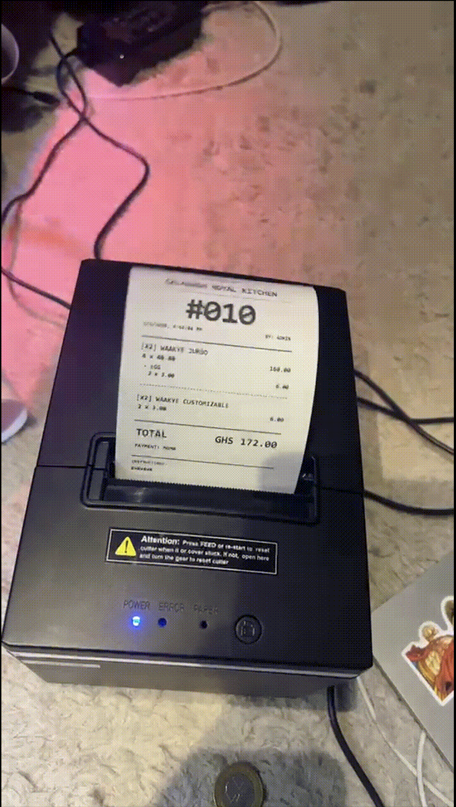
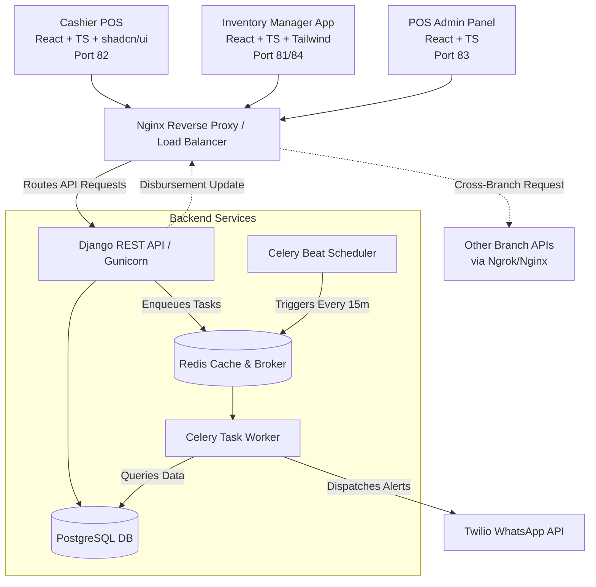

# PasmenPasara POS v3: Multi-Frontend POS & Inventory System

A production-ready POS and inventory management system built for commercial kitchens. It handles real-time stock deductions, batch recipe tracking, and automated low-stock alerts.

---

## 🛑 The Problem

Commercial kitchens and multi-branch restaurants often struggle with:
1. **Blind spots in inventory:** Relying on manual end-of-day counts instead of real-time tracking, leading to unexpected stockouts.
2. **Bad accountability & theft:** Without a unified digital ledger and strict audit trails, management struggles to prevent employee theft, identify discrepancies, or properly oversee daily cash flows and material usage.
3. **Complex recipe deduction:** When cooking large batches (e.g., 20 liters of soup), accurately deducting individual raw ingredients (salt, tomatoes, oil) from the main store is a logistical nightmare.
4. **Order chaos & miscommunication:** Relying on waiters shouting orders or dropping handwritten notes to the kitchen causes friction, wrong orders, and poor customer tracking.
5. **Alert fatigue:** Getting pinged for every single low-stock item instead of receiving clean, batched summaries.

---

## 💡 The Solution

PasmenPasara POS v3 solves these issues by splitting the architecture into specialized React frontends communicating with a single Django REST API. We use Celery and Redis in the background to handle the heavy lifting: cascading inventory deductions based on recipe multipliers and batching low-stock alerts via WhatsApp.

To improve accountability and workflow, the system enforces a strict **Dual-Receipt Flow**: cashiers ring up the order and the system automatically prints two thermal receipts. One acts as the kitchen ticket, and the other is kept by the customer. When the food is ready, the customer's name is called and verified against their receipt—eliminating the need for complex, error-prone waiter apps.

---

## 🎥 Full System Walkthrough & Demos

### Video Walkthrough
Watch the full system breakdown and demo on YouTube:

[](https://www.youtube.com/watch?v=IBhFM26pGS8)

**Timestamps:**
- [0:00](https://www.youtube.com/watch?v=IBhFM26pGS8&t=0s) Introduction
- [1:17](https://www.youtube.com/watch?v=IBhFM26pGS8&t=77s) Pain points
- [1:49](https://www.youtube.com/watch?v=IBhFM26pGS8&t=109s) Cashier role overview
- [3:00](https://www.youtube.com/watch?v=IBhFM26pGS8&t=180s) Dashboard walkthrough
- [3:30](https://www.youtube.com/watch?v=IBhFM26pGS8&t=210s) Raw items setup
- [4:30](https://www.youtube.com/watch?v=IBhFM26pGS8&t=270s) Stock management
- [6:00](https://www.youtube.com/watch?v=IBhFM26pGS8&t=360s) Wastage & adjustments
- [7:00](https://www.youtube.com/watch?v=IBhFM26pGS8&t=420s) Low-stock alerts
- [8:00](https://www.youtube.com/watch?v=IBhFM26pGS8&t=480s) Production / recipes
- [11:00](https://www.youtube.com/watch?v=IBhFM26pGS8&t=660s) Menu & dish setup
- [13:00](https://www.youtube.com/watch?v=IBhFM26pGS8&t=780s) Recipes to dishes
- [15:00](https://www.youtube.com/watch?v=IBhFM26pGS8&t=900s) Pricing & variations
- [17:00](https://www.youtube.com/watch?v=IBhFM26pGS8&t=1020s) Customizations / options
- [19:00](https://www.youtube.com/watch?v=IBhFM26pGS8&t=1140s) Linking dishes to options
- [20:00](https://www.youtube.com/watch?v=IBhFM26pGS8&t=1200s) User & role management
- [21:30](https://www.youtube.com/watch?v=IBhFM26pGS8&t=1290s) Branch management
- [22:30](https://www.youtube.com/watch?v=IBhFM26pGS8&t=1350s) Suppliers & purchases
- [26:00](https://www.youtube.com/watch?v=IBhFM26pGS8&t=1560s) POS order flow (cashier)
- [28:00](https://www.youtube.com/watch?v=IBhFM26pGS8&t=1680s) Order editing & status
- [29:30](https://www.youtube.com/watch?v=IBhFM26pGS8&t=1770s) Checkout & payment
- [31:00](https://www.youtube.com/watch?v=IBhFM26pGS8&t=1860s) Kitchen cook log
- [33:00](https://www.youtube.com/watch?v=IBhFM26pGS8&t=1980s) Inventory deduction
- [35:00](https://www.youtube.com/watch?v=IBhFM26pGS8&t=2100s) Analytics & reporting
- [37:00](https://www.youtube.com/watch?v=IBhFM26pGS8&t=2220s) Alerts & notifications
- [38:30](https://www.youtube.com/watch?v=IBhFM26pGS8&t=2310s) Mobile responsiveness
- [38:54](https://www.youtube.com/watch?v=IBhFM26pGS8&t=2334s) Wrap-up

### 🧾 Hardware Integration: Thermal Printing & Dual-Receipt Flow
The system natively supports thermal receipt printing at checkout. It automatically generates a kitchen ticket and a customer copy for order verification.

<a href="https://youtube.com/shorts/yDWNPuB6nlo"></a>

*Click the image above to watch it in action.*

### 🎥 System in Action (Production Demo)
The POS system actively being used in a real restaurant workflow:

<a href="https://youtube.com/shorts/6FUaBvKSEJU"></a>

*Click the image above to watch it in action.*

---

## ✨ Key Features

### 🏢 Architecture & Multi-Tenancy
- **Specialized Micro-Frontends**: Separate React/Vite applications tailored for specific user roles (Cashier POS, Inventory Managers, System Admins). *(Note: The mobile waiter app has been deprecated in favor of the more reliable dual-receipt cashier flow).*
- **Comprehensive Audit Logging**: Custom Django middleware intercepts and logs every state-mutating API call (`POST`/`PATCH`/`DELETE`), tracking the user ID, endpoint, IP address, and payload. This provides management with a tamper-proof ledger to enforce accountability.

### 🍳 Kitchen Inventory
- **Batch Recipe Deduction**: When kitchen staff logs a cooked batch, the system dynamically calculates raw ingredient usage based on predefined recipes and deducts it from the main store.
- **Production Reversal (Undo)**: Reversing a batch log automatically recalculates and restores the exact quantities of raw ingredients back into the inventory.
- **Cross-Branch Disbursements via Nginx/Ngrok**: Built-in logic to handle the transfer of raw materials between branches. When a disbursement is initiated, the backend dispatches a request that routes through the Nginx/Ngrok network to hit the receiving branch's inventory update endpoint, keeping stock levels synced across locations.

### 🤖 Background Jobs & Notifications
- **Smart WhatsApp Alerts**: A Celery Beat cron job checks stock levels every 15 minutes. It aggregates low-stock and out-of-stock items and sends a single WhatsApp alert via the **Twilio API**.
- **Global Alert Cooldowns**: A buffer system prevents notification spam during rapid stock fluctuations or system restarts.
- **Nightly Revenue Summaries**: Automated end-of-day reports detailing total revenue, order counts, and critical stock warnings sent directly to management.

---

## 🏗 System Architecture

We containerized the entire stack using Docker and Docker Compose.



---

## 🛠 Tech Stack

**Backend**
- Python, Django 5, Django REST Framework (DRF)
- PostgreSQL 15
- Celery, Redis
- JWT Authentication (SimpleJWT)
- Twilio API (WhatsApp Business)

**Frontend**
- React 18/19, TypeScript, Vite
- Tailwind CSS, shadcn/ui, Framer Motion
- React Query (@tanstack/react-query), Axios
- Recharts

**Infrastructure**
- Docker, Docker Compose
- Gunicorn, Nginx
- Ngrok (for webhook/external testing)

---

## 🔄 Core Workflows

### 1. Dual-Receipt Order Pipeline
*`Ring Up → Print → Prep → Verify`*
1. **Ring Up**: Cashier inputs the customer's name and order into the POS.
2. **Print**: System prints two thermal receipts. One goes to the kitchen for prep, the other stays with the customer.
3. **Verify**: When the order is ready, the kitchen alerts the front, the customer's name is called, and the order is verified against their receipt.

### 2. Batch Production Pipeline
*`Input → Processing → Output`*
1. **Definition**: Admin defines a `BatchName` and assigns a `BatchProductionRecipe` mapping raw items (e.g., 5kg Tomatoes, 200g Salt).
2. **Execution**: Chef logs the cooking of 3 batches via the UI.
3. **Processing**: Backend intercepts the POST request, multiplies the recipe by 3, checks current stock, and atomically updates `MainStoreRawItems`.
4. **Validation**: If successful, a `BatchProductionLog` is created and an `ActivityLog` records the user action.

### 3. Smart Alert Pipeline
*`Cron → Evaluation → Aggregation → Dispatch`*
1. **Trigger**: `Celery Beat` fires `check_stock_levels()` every 15 minutes.
2. **Evaluation**: Queries PostgreSQL for all `RawItems` where `quantity_in_stock <= reorder_level`.
3. **Aggregation**: Compiles all flagged items into a single summary payload.
4. **Cooldown Check**: Verifies if an alert was sent in the last 2 minutes to prevent spam.
5. **Dispatch**: Pushes the payload to the Twilio API, updating the `last_whatsapp_sent_at` timestamp.

---

## ⚙️ Installation & Setup

### Prerequisites
- Docker and Docker Compose installed
- Twilio Account SID and Auth Token (for WhatsApp features)

### 1. Environment Configuration
Create a `.env` file in the root directory:
```env
# Database
POSTGRES_DB=pasmenpasara_db
POSTGRES_USER=postgres
POSTGRES_PASSWORD=supersecretpassword

# Twilio Configuration
TWILIO_ACCOUNT_SID=your_account_sid
TWILIO_AUTH_TOKEN=your_auth_token
TWILIO_WHATSAPP_FROM=+1234567890
WHATSAPP_ADMIN_NUMBERS=+233555555555,+233200000000
BRANCH_NAME="Main Branch HQ"

# Frontend API Mapping
VITE_API_BASE_URL=http://localhost:8000
```

### 2. Spin up the cluster
Build and start all 6 containers:
```bash
docker compose up -d --build
```

### 3. Database Initialization
Run Django migrations and create the initial administrator account:
```bash
docker compose exec web python manage.py migrate
docker compose exec web python manage.py createsuperuser
```

### 4. Access the Apps
- **Core API**: `http://localhost:8000`
- **Inventory Manager**: `http://localhost:81` / `http://localhost:84`
- **Cashier POS**: `http://localhost:82`
- **Admin Dashboard**: `http://localhost:83`

---

## 🧠 Technical Highlights

- **Polymorphic Data Modeling**: Handles the complexity of linking Sales and Adjustments to either standalone `Products`, `Customizables`, or `RawItems` using Django `UniqueConstraints` and custom `clean()` validation methods.
- **Defensive Task Queuing**: The Celery implementation uses global cooldowns and strict timestamp tracking (`last_whatsapp_sent_at`) to ensure network failures or rapid worker restarts never result in duplicate WhatsApp messages.
- **Middleware-Driven Auditing**: A custom `ActivityLogMiddleware` cleanly intercepts the request/response lifecycle, extracting the user session, parsing the JSON payload, and persisting a tamper-proof audit trail without cluttering views.
- **Optimized Frontend Bundles**: Splitting the frontends into three distinct repositories reduces the bundle size for checkout devices while allowing heavy charting libraries (`Recharts`) to exist solely on the admin dashboard.

---

## 🚀 Future Improvements

1. **WebSockets for Kitchen Displays**: Migrate the order queue from a polling architecture to real-time Server-Sent Events (SSE) or Django Channels (WebSockets) for instant Kitchen Display System (KDS) updates.
2. **Schema-Based Multi-Tenancy**: Transition from logical branch separation to PostgreSQL schema-based multi-tenancy (using `django-tenant-schemas`) to support true SaaS-level scalability.
3. **Predictive Analytics**: Introduce an ML microservice that analyzes historical `BatchProductionLog` and `Sale` data to predict when raw materials will run out, rather than reacting to static reorder levels.
